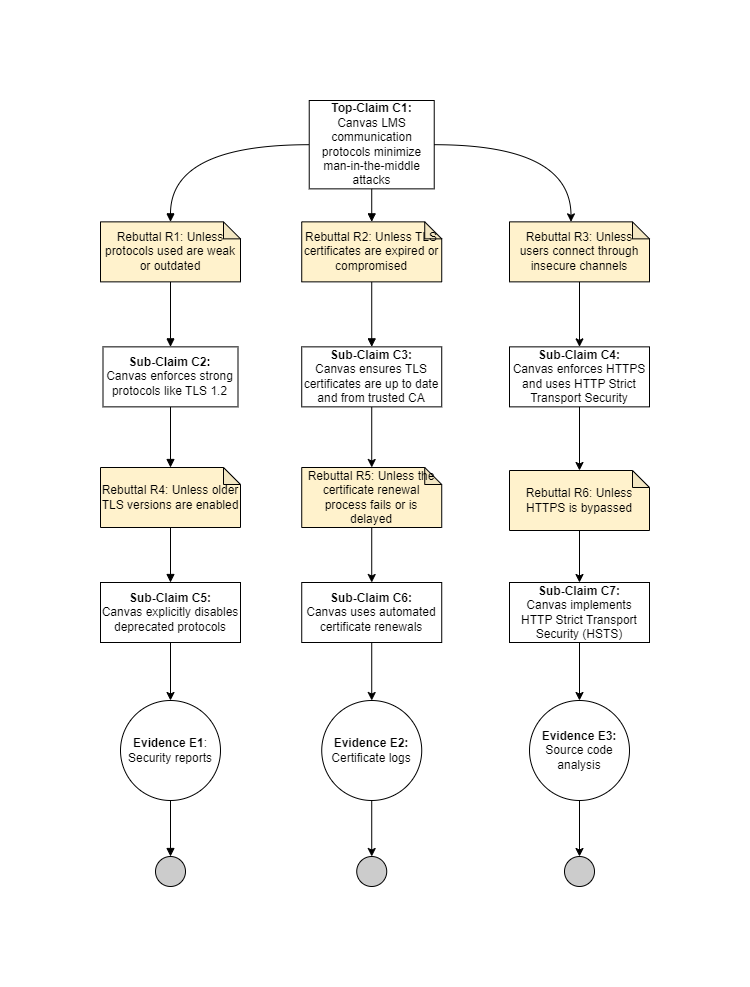

# CYBR-8420 Assurance Cases

## Link to Project Board
[Click here to view the board](https://github.com/users/jschrack/projects/4/views/1)

---

## Claims

### **Claim 1 - Augusto**

**Part 2 Assessment** - 

----

### **Claim 2 - Deb**

**Part 2 Assessment** - 

----

### **Claim 3 - Geoff**

**Part 2 Assessment** - 

----

### **Claim 4 - Minimize Man-In-The-Middle Attacks**

**Part 2 Assessment**

*E1 - Security Reports*: [Canvas LMS Trust Center](https://www.instructure.com/trust-center/security) explicitly states that all traffic is encrypted using TLS 1.2 or higher. As there was no other public report providing this information, an analysis into the source code was done as well. The [cassandra.yaml](https://github.com/instructure/canvas-lms/blob/master/build/docker-compose/cassandra/cassandra.yaml) file is a configuration file for an Apache Cassandra instance. Within that file the comments mention that for inter-node encryption the default settings are TLS v1 and RSA 1024 bit keys. There is a potential gap in security here as the inner node TLS may be defaulting to TLS v1 in certain instances.   

*E2 - Certificate Logs*: Using a certificate log checker the certificates appear to be issued by Amazon on a semi-annual basis (checked using crt.sh). AWS certificate manager automatically renews without any manual intervention. This ensures certificates are renewed way before the expiration date and are done correctly. It is unlikely that there are gaps within the automated certificate renewal that is completed by AWS.

*E3 - Source Code Analysis*: Upon reviewing the Canvas LMS software source code, it can be directly seen that HSTS is enabled and SSL is required. In the source code it is also mentioned that non-HTTPS is redirected at the apache layer. Though there is a redirect at the server level, on subdomains HSTS is directly set to false. A comment in the code mentions that HSTS has historically not been set on subdomains and that enabling it may cause issues. This may lead to a potential security gap in the implementation of these protocols (found in the [production.rb](https://github.com/instructure/canvas-lms/blob/master/config/environments/production.rb) file). Upon running a check through hardenize.com, the results stated that there was an issue with HSTS configuration (it didn't go into detail), which may be related to the above issue.

----

### **Claim 5 - Mark**

**Part 2 Assessment** - 

## Alignment of Evidence Assessment
We can add a short summary of the individual assessments here or just remove

## Team Reflection

