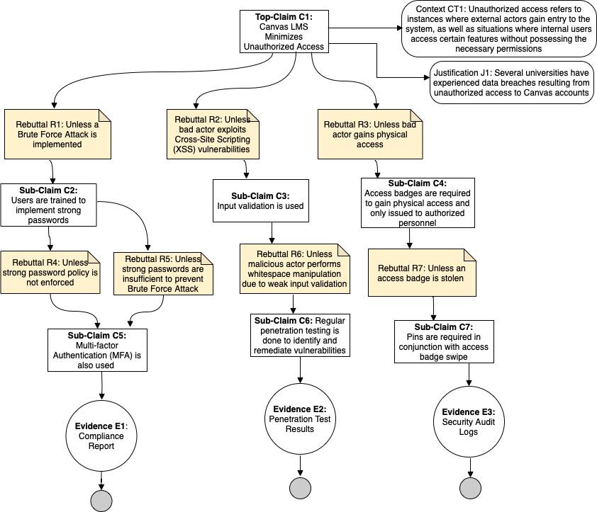
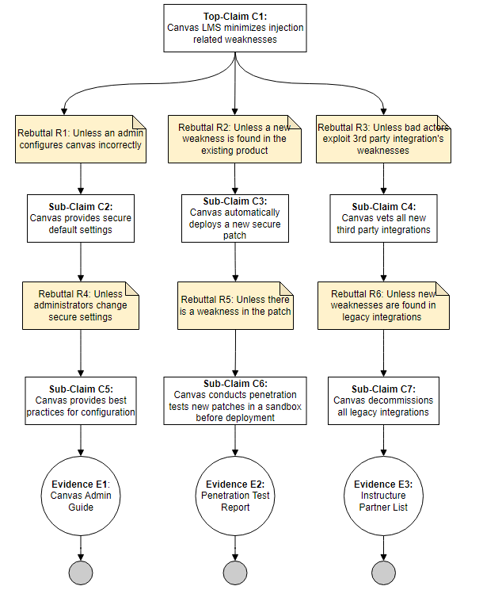

# CYBR-8420 Assurance Cases

## Link to Project Board
[Click here to view the board](https://github.com/users/jschrack/projects/4/views/1)

---

## Claims

### **Claim 1 - Canvas-LMS role-based access control (RBAC) reduces the risk of permission misconfiguration.**

**Part 2 Assessment** - 
*E1 – Application Security Process*: Canvas LMS takes many steps to prevent pushing a known vulnerability into their patches, one of the steps is doing Security Audits, which they release to the public, latest one here [Canvas Security Audit 2023](https://www.instructure.com/sites/default/files/file/2023-04/Canvas_Security%20Audit_Report_2023.pdf). The Security Audits help Canvas LMS find critical/high/medium/low/information vulnerabilities, and how it impacts them. Helping investors and customers feel more secure, which each progress.

*E-2  – Admin Guide: Roles and Permissions*: Canvas LMS has detail documentation on how to implement Roles and Permissions in their Admin Guide, under Roles and Permissions. The document can be found here [What user roles and permissions are avialable in Canvas?](https://community.canvaslms.com/t5/Admin-Guide/What-user-roles-and-permissions-are-available-in-Canvas/ta-p/102 ). Even do it do not cover every possible scenario, it covers a large majority of it. They also include the Canvas Account Permissions resource document here [Canvas Account Role Permissions](https://community.canvaslms.com/t5/Canvas-Resource-Documents/Canvas-Account-Role-Permissions/ta-p/387078).

*E-3 – Security Testing*: On their main page, under Security, Canvas LMS promises users that they implement both preventative and detective mechanism thought the Software Development Life Cycle. They also implement a full QA test before they can push any update.

*E-4 – Bug Bounty Program*: Canvas LMS has a private bug bounty program, this is great because it can keep a lot of their vulnerabilities away from the public. Preventing bad actors from acting on does vulnerabilities before they are fixed. There is a process to be part of the program, which involves you submitting your Bugcrowd username and resume to security@instructore.com, a bad actor can use social engineering to get into the program. It is not clear if there are additional steps to prevent this. 

----

### **Claim 2 - Canvas LMS Minimizes Unauthorized Access**

**Part 2 Assessment** - 

*E1 - Compliance Report*: Canvas LMS product compliance packages are available upon request at: [Canvas Compliance Report](https://www.instructure.com/trust-center/resources). While Canvas LMS offers access to compliance reports, it is unclear how reliable delivery is upon request. Additionally, it's uncertain whether these reports contain adequate details regarding critical security features like MFA or incident response information.  

*E2 - Penetration Test Results*: Penetration testing is completed annually through Bugcrowd, Inc. and the reports are availabe on the Instructure site. The latest report can be found at: [Canvas LMS Pentestig Report](https://www.instructure.com/sites/default/files/file/2023-04/Canvas_Security%20Audit_Report_2023.pdf). Potential gaps in pentesting results may include a limited testing scope, an insufficiently comprehensive methodology that fails to identify all types of XSS vulnerabilities, or uncertainty about whether the test was conducted in a test environment or the live production environment.

*E3 - Security Audit Logs*: Instructure maintains a Security Overview document that covers physical security for data centers, detailing the use of state-of-the-art electronic surveillance and multi-factor access control systems. Data centers are protected 24/7 by trained security guards and access is authorized strictly on a least-privileged basis. Security Audit Logs are available for review by security staff with appropriate levels of access. The Security Overview document can be found at: [Canvas LMS Security Overview Policy](https://www.instructure.com/trust-center/resources). A potential gap for review of security audit logs is human error, poor log retention policies, or inadequate review frequency.

----

### **Claim 3 - Geoff**

**Part 2 Assessment** - 

----

### **Claim 4 - Minimize Man-In-The-Middle Attacks**

**Part 2 Assessment**

*E1 - Security Reports*: [Canvas LMS Trust Center](https://www.instructure.com/trust-center/security) explicitly states that all traffic is encrypted using TLS 1.2 or higher. As there was no other public report providing this information, an analysis into the source code was done as well. The [cassandra.yaml](https://github.com/instructure/canvas-lms/blob/master/build/docker-compose/cassandra/cassandra.yaml) file is a configuration file for an Apache Cassandra instance. Within that file the comments mention that for inter-node encryption the default settings are TLS v1 and RSA 1024 bit keys. There is a potential gap in security here as the inner node TLS may be defaulting to TLS v1 in certain instances.   

*E2 - Certificate Logs*: Using a certificate log checker the certificates appear to be issued by Amazon on a semi-annual basis (checked using crt.sh). AWS certificate manager automatically renews without any manual intervention. This ensures certificates are renewed way before the expiration date and are done correctly. It is unlikely that there are gaps within the automated certificate renewal that is completed by AWS.

*E3 - Source Code Analysis*: Upon reviewing the Canvas LMS software source code, it can be directly seen that HSTS is enabled and SSL is required. In the source code it is also mentioned that non-HTTPS is redirected at the apache layer. Though there is a redirect at the server level, on subdomains HSTS is directly set to false. A comment in the code mentions that HSTS has historically not been set on subdomains and that enabling it may cause issues. This may lead to a potential security gap in the implementation of these protocols (found in the [production.rb](https://github.com/instructure/canvas-lms/blob/master/config/environments/production.rb) file). Upon running a check through hardenize.com, the results stated that there was an issue with HSTS configuration (it didn't go into detail), which may be related to the above issue.

----

### **Claim 5 - Minimize Injection Related Weaknesses**

**Part 2 Assessment** - 
*E1 - Canvas Admin Guide*: Canvas provides a comprehensive guide on how to configure many different pieces. Due to the size of canvas documentation does get hard to navigate, but it does provide a guide for many settings that protect against injection related weaknesses.This is listed on their community site: [Canvas Admin Guide](https://community.canvaslms.com/t5/Admin-Guide/tkb-p/admin). The biggest potential gap is the human error of implementing all steps and understanding of what is needed. 

*E2 - Penetration Test Report*: The Canvas LMS Security Audit Report 2023: [Penetration Test Report](https://www.instructure.com/sites/default/files/file/2023-04/Canvas_Security%20Audit_Report_2023.pdf) provides a detailed review of the security measures in place for Canvas LMS. It outlines the methodology used, including bug bounty programs, and discusses the types of vulnerabilities identified. The report summarizes the findings for 2022 and highlights improvements made to strengthen Canvas' security posture. The gaps may be possibly missing a vulnerability in testing that was not remediated, or if there are physical security issues that may create weaknesses.

*E3 - Instructure Partner List*: You can find documentation for all integrations including an individual guide per each integration: [Instructure Partner List](https://community.canvaslms.com/t5/Partners/ct-p/partners). The major gap in this list would be that it does not notify a user of an integration becoming legacy. The integration is simply removed from the list for future use, but extra steps would need to be taken to notify all current users. 

## Alignment of Evidence Assessment
We can add a short summary of the individual assessments here or just remove

## Team Reflection

