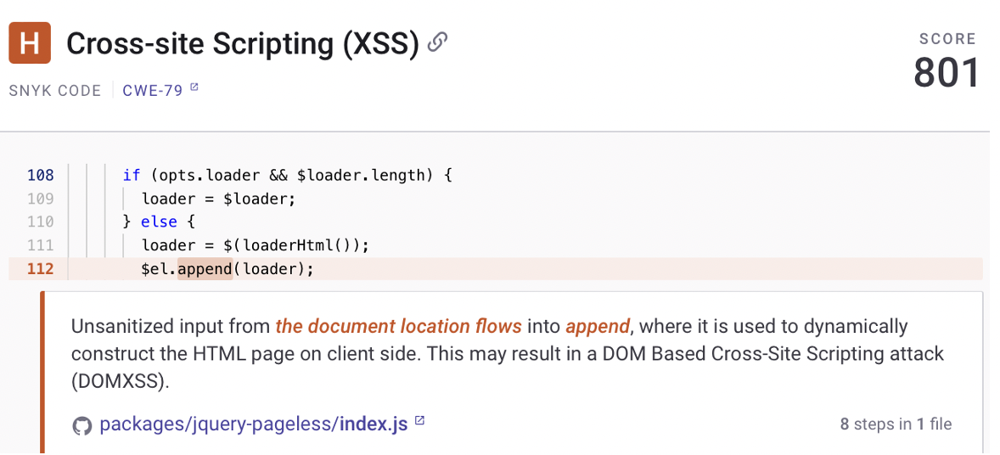
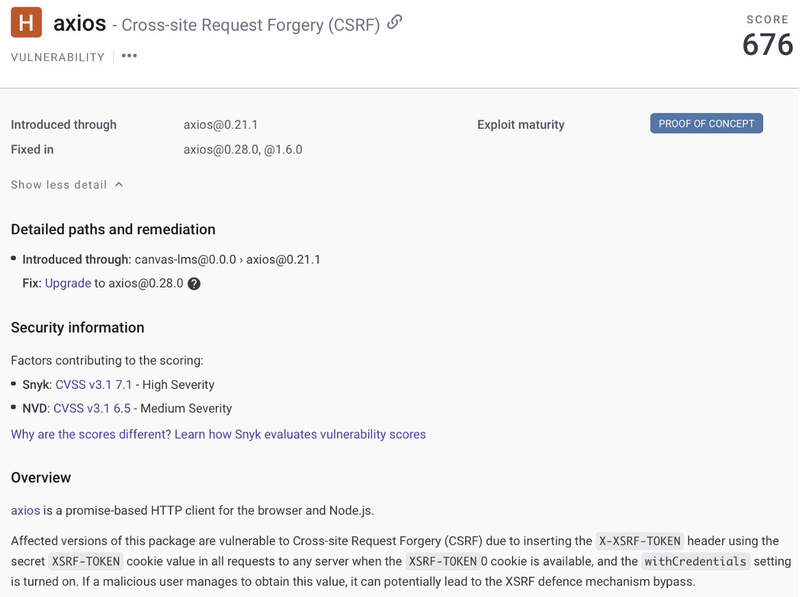

# CYBR-8420 Code Analysis for Software Security Engineering

## Link to Project Board
[Click here to view the board](https://github.com/users/jschrack/projects/6/views/1)

## Code Review Stratgey

### Relevant Code Modules
Scope your code review effort to specific code modules/files relevant to misuse cases, assurance claims, and threat models. This is a scenario or weakness-based approach.

### CWEs
Identify a list of 5-10 CWEs (as specific as possible) that would be most important for findings from your manual or automated code review. The selection of CWEs will depend on the type of programming language, platform, and architecture of your project. Knowing what you are looking for in a large codebase will help you focus your efforts. This is a checklist-based approach. 

1. 
2. 
 **3. CWE-79: Improper Neutralization of Input During Web Page Generation / Cross-site Scripting**
   
  **Description:** The product does not neutralize or incorrectly neutralizes user-controllable input before it is placed in output that is used as a web page that is served to other users.
  •	Type 1: Reflected XSS (or Non-Persistent) - The server reads data directly from the HTTP request and reflects it back in the HTTP response. Reflected XSS exploits occur when an attacker causes a victim to supply dangerous content to a vulnerable web application, which is then reflected back to the victim and executed by the web browser. The most common mechanism for delivering malicious content is to include it as a parameter in a URL that is posted publicly or e-mailed directly to the victim. URLs constructed in this manner constitute the core of many phishing schemes, whereby an attacker convinces a victim to visit a URL that refers to a vulnerable site. After the site reflects the attacker's content back to the victim, the content is executed by the victim's browser.
•	Type 2: Stored XSS (or Persistent) - The application stores dangerous data in a database, message forum, visitor log, or other trusted data store. At a later time, the dangerous data is subsequently read back into the application and included in dynamic content. From an attacker's perspective, the optimal place to inject malicious content is in an area that is displayed to either many users or particularly interesting users. Interesting users typically have elevated privileges in the application or interact with sensitive data that is valuable to the attacker. If one of these users executes malicious content, the attacker may be able to perform privileged operations on behalf of the user or gain access to sensitive data belonging to the user. For example, the attacker might inject XSS into a log message, which might not be handled properly when an administrator views the logs.
•	Type 0: DOM-Based XSS - In DOM-based XSS, the client performs the injection of XSS into the page; in the other types, the server performs the injection. DOM-based XSS generally involves server-controlled, trusted script that is sent to the client, such as Javascript that performs sanity checks on a form before the user submits it. If the server-supplied script processes user-supplied data and then injects it back into the web page (such as with dynamic HTML), then DOM-based XSS is possible.

Once the malicious script is injected, the attacker can perform a variety of malicious activities. The attacker could transfer private information, such as cookies that may include session information, from the victim's machine to the attacker. The attacker could send malicious requests to a web site on behalf of the victim, which could be especially dangerous to the site if the victim has administrator privileges to manage that site. Phishing attacks could be used to emulate trusted web sites and trick the victim into entering a password, allowing the attacker to compromise the victim's account on that web site. Finally, the script could exploit a vulnerability in the web browser itself possibly taking over the victim's machine, sometimes referred to as "drive-by hacking."

 **4. CWE-352: Cross-Site Request Forgery (CSRF)**

  **Description:** The web application does not, or can not, sufficiently verify whether a well-formed, valid, consistent request was intentionally provided by the user who submitted the request. When a web server is designed to receive a request from a client without any mechanism for verifying that it was intentionally sent, then it might be possible for an attacker to trick a client into making an unintentional request to the web server which will be treated as an authentic request. This can be done via a URL, image load, XMLHttpRequest, etc. and can result in exposure of data or unintended code execution.

 **5. CWE-89: Improper Neutralization of Special Elements used in an SQL Command ('SQL Injection')**

 ** 6. 

7.
8.
9.

### Automated Code-Scanning Tools
Select automated code-scanning tools based on the software composition of your project. One tool may not be enough. If no free and open-source tools are available, see if you can get a free trial version for a few days

 **SNYK** - Uses real time semantic code analysis based on machine learning to determine code issues such as dead code, type inference, data flow issues, API misuse, and type mismatches for Java, JavaScript, TypeScript, and Python.

### Anticipated Challenges
What challenges did you expect before starting the code review?
How did your code review strategy attempt to address the anticipated challenges?

## Automated Code Review Findings
Document findings from automated code scanning (if available). Include links to tool outputs

  **CWE-79:** Using SNYK, I executed a scan to look for XSS weaknesses. Complete results are available at: [Canvas-LMS SNYK scan results](https://app.snyk.io/org/peachykeen00/project/129f2d2c-52f6-4b13-8d76-1f819ec1d2d7)
  There were a total of 15 XSS vulnerabilities (6 high, 8 medium, and 1 low severity). An example of one of the XSS vulnerabilities is below, from the packages/jquery-pageless/index.js file:

  **CWE-352:** Using SNYK, I scanned the files in the Canvas-LMS repository on GitHub for CSRF vulnerabilities. There weren't many results with this specific weakness, but there was one specific to Axios, a third-party JavaScript library used to make HTTP requests from a browser. It provides an easy-to-use interface for sending asynchronous requests. The details of the vulnerability are included here:

  **CWE-89:** I scanned the codebase using the command
  
    find ./app -name \*.rb -type f -print0 | xargs -0 grep -iE "\W(SELECT|INSERT|UPDATE|DELETE)\W"
    
  to find SQL queries. This led to a large number of false positives but also revealed many instances where SQL queries were built using string processing rather than with an ORM library or SQL parameterization. This is problematic due to the level of care required to prevent SQL injection when building raw queries (and as a side note, queries that do not use ORM make it much harder to use a NoSQL database with Canvas). Several of these queries are very complex, with dozens of variables that contain user input, and some of the queries appear in functions that are directly responsible for dispatching web API calls.

## Manual Code Review Findings
Document findings from a manual code review of critical security functions identified in misuse cases, assurance cases, and threat models.

  **CWE-79:** Not being proficient in Javascript, I used ChatGPT to further investigate code from the packages/jquery-pageless/index.js file that was included in the automated XSS tool results. The analysis returned the following results from that file:
  
1.	*settings.loaderImage*
      -The loaderHtml function embeds the settings.loaderImage directly into the src attribute of an  tag: 
      -Risk: If settings.loaderImage is user-controllable and not validated, an attacker could inject a malicious URL or JavaScript scheme (javascript:alert('XSS')), leading to XSS.
2.	loaderMsg
      -The loader message is set via settings.loaderMsg: $('#pageless-loader .msg').html(opts.loaderMsg);
      -Risk: Directly injecting loaderMsg into .html() without escaping exposes the application to XSS if the message contains malicious HTML or JavaScript.
3.	*Dynamic Data Injection ($.get Response)*
      -The AJAX request appends data received from the server into the DOM: loader ? loader.before(data) : element.append(data);
      -Risk: If the server response (data) includes malicious scripts and the content is appended to the DOM without sanitization, this could lead to XSS.
4.	*settings.scrape*
      -The settings.scrape function is applied to the AJAX response: var data = $.isFunction(settings.scrape) ? settings.scrape(data, xhr) : data;
      -Risk: If the custom scrape function introduces untrusted data or modifies the response insecurely, this could result in XSS when appended to the DOM.

   **CWE-352:** Not being proficent in Ruby, I used ChatGPT to analyze files that had returned CSRF vulnerablities in the CodeQL scan that Jesse ran. The results from the app/controllers/lti/ims/authentication_controller.rb file are as follows:
   1.	Skipped CSRF Protection
        -In the authorize_redirect method: *skip_before_action :verify_authenticity_token, only: :authorize_redirect*, CSRF protection is explicitly skipped, which is a common indicator of potential CWE-352 risks. This allows the endpoint to be accessed without verifying the legitimacy of the request's origin.
2.	Open Redirect Possibility
        -The authorize_redirect_url method constructs a redirect URL based on user input (lti_1_3_authorization_url), which uses oidc_params. If input validation or sanitization of redirect_uri in oidc_params is insufficient, this could be abused to redirect users to malicious sites.
3.	Strong Parameter Enforcement
        -The oidc_params method ensures that only expected parameters are permitted: *params.permit(*(OPTIONAL_PARAMS + REQUIRED_PARAMS))*, however, the contents of redirect_uri are not validated against a strict whitelist, which might enable attackers to manipulate redirects.
4.	Contextual Validations
        -The code performs several validations (e.g., validate_oidc_params!, validate_client_id!, validate_current_user!) to ensure the request is legitimate. These are robust checks against certain kinds of abuse but do not directly address CSRF.
 

## Summary of Findings
Provide a summary of findings from manual and/or automated scanning. This summary should include mappings to CWEs to describe significant findings and perceive risk in your hypothetical operational environment.

  **CWE-79:** CodeQL returned several more instances of potential XSS file vulnerabilities than SNYK. The results from SNYK are mostly consistent with the manual code analysis, with the manual analysis returning a bit more detail.

  **CWE-352:** There were not many instances found with SNYK for CSRF, but CodeQL did return several potential files with vulnerabilities. Using manual code review with ChatGPT, a significant amount of detail was revealed.

## Planned Contributions
Describe your planned or ongoing contributions to the upstream open-source project (I.documentation, design changes, code changes, communications, etc.). Your response can be based on any of the prior assignments in the class.

## Team Reflection
Include a reflection of your teamwork for this assignment. What issues occurred? How did you resolve them? What did you plan to change moving forward?
