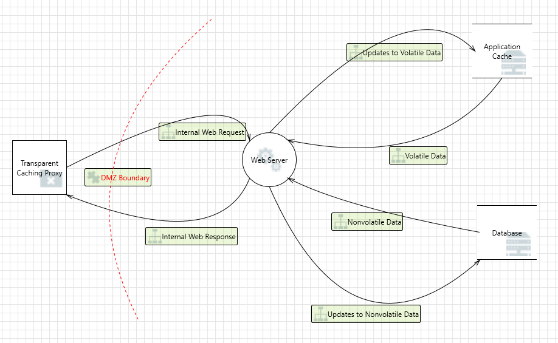

# CYBR-8420 Designing for Software Security Engineering

## Link to Project Board
[Click here to view the board](https://github.com/users/jschrack/projects/5/views/1)

---

## Data Flow Diagram

[Threat Modeling Report](https://jschrack.github.io/CYBR-8420/Deliverables/Designing%20for%20Software%20Security%20Engineering/threat_modeling_report.html)

## Part 2 Observations

After reviewing the threat modeling report, we concluded as a team that the following numbers need more investigation: #2, #9, #15

Canvas LMS is designed with security in mind, but like any software platform, it may still be susceptible to vulnerabilities. One potential design-related gap highlighted by the DFD analysis is the absence of certifcate-based validation for the Data Store database; however, it is possible that such a feature is in place but not disclosed in default configuration documentation. While Canvas LMS seems to implement a robust network security strategy, past evaluations have uncovered vulnerabilities in its security measures. For instance, although the platform provides protections against CSRF and XSS attacks, this does not guarantee that its mitigation capabilities are entirely free of flaws or limitations.

Another potential designed gap could be elevation by changing the execution flow in web server. Canvas LMS has basic input validation but needs additional protection from program flow integrity. This could be done by implementing input validation on every input (updated with new vulnerability finds) and code integrity checks to prevent attackers from altering the web server’s execution flow.

Lastly, Canvas LMS potentially lacks input validation within the codebase. Due to there being so many different places where validation would need to be verified, this issue still needs to be investigated. The best approach for checking input validation would likely be the use of an automated tool. This would help ensure that each potential location is checked. In the spots that were checked, proper input validation and sanitization were in place.

## Team Reflection

This week’s assignment was a bit different from the previous ones in terms of dividing the workload and coordinating our inputs. In the last two assignments, each team member was responsible for creating a diagram. However, for this assignment, we quickly determined that only one diagram was needed. One teammate took on the task of creating and updating the diagram, while the rest of us divided up the threats. Afterward, we had to determine the best way to coordinate and compile our inputs, as GitHub didn’t seem practical for this purpose. Most of our coordination was done through Discord via chat and voice discussions. Filtering updates through GitHub felt more cumbersome compared to completing our individual portions and then meeting to consolidate them into a single HTML file. Ultimately, we adapted and successfully completed the assignment.
