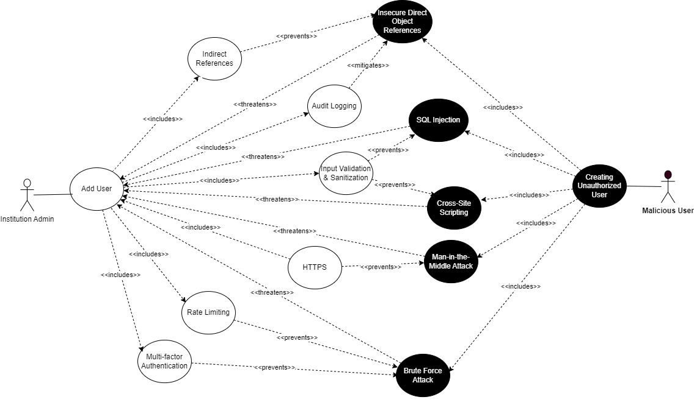

# CYBR-8420 Requirements for Software Security Engineering

## Use Case Diagrams
### Interaction 1 - Augusto
### Misuse Case 2 - Student updates gradebook

**Use Case**

An instructor logs into the gradebook system to update students' grades.

**Misuse Case**

An unauthorized student gains access to the gradebook system with an objective to manipulate the gradebook, either by altering their own grades or those of their peers by using Session Hijacking, Cross-Site Request Forgery (CSRF), or SQL injection.

### Interaction 3 - Geoff
### Misuse Case 4 - Institution admin adds a user

**Use Case**

An institution admin adds a user to the system (Professor, student, admin, etc..).

**Misuse Case**
A malicious user/hacker creates an unauthorized user utlizing techniques like SQL injection, cross-site scripting, man-in-the-middle, insecure direct object referecnes, and brute force attacks.

### Interaction 5 - Mark

## AI Prompt

## List of Security Requirements derived from misuse case analysis

 - Input Validation- Implement strict input validation to defend against SQL injection attacks using JavaScript or HTML5 to manage input validation parameters.
 - Access Control- Utilize session timeouts and CAPTCHA as means of access control. Session timeouts log a user out after a predetermined duration of inactivity. CAPTCHA requires text-based, image-based, or audio verification to prevent unauthorized access.
 - Rate Limiting - Limit the amount of requests from a user/device to prevent brute force attempts and DDOS attacks.
 - Multi-factor Authentication - Utilize multiple authentication methods to prevent unauthorized access to accounts, especially privelleged ones.
 - Audit Logging - Keeping detailed logs of user interactions with the system in order to detect and prevent misuses.
 - Indirect References - Utilize indirect references (use claims/token to validate user/input) to prevent insecure direct object references.
 - HTTPS - Ensure all web traffic is served over HTTPS by using SSL/TLS certificates.

## Security Requirements Assesment

Canvas LMS advertises the following security features that mitigate security requirements derived from the misuse case analyses.

 - Input Validation:
   - CSRF Protection / Cross-Site Scripting (XSS) Protection
   - Audit Logs

 - Access Controls:
   - Session Timeouts
   - Role-Based Access Control (RBAC)

## Security-related Configuration and Installation Issues

## Link to Project Board
[Click here to view the board](https://github.com/users/jschrack/projects/2/views/1)

## Individual Contributions
### Augusto
### Deb

- Completed misuse case analysis for the instructor / gradebook relationship
- Built list of security requirements dervied from misuse case analysis and compared them to advertised security features of software to determine sufficiency of current security features
- Researched OSS security configuration / installation documentation for Canvas LMS and contributed this section in Part II of the assignment
  
### Geoff
### Jesse
### Mark
## Team Reflection

